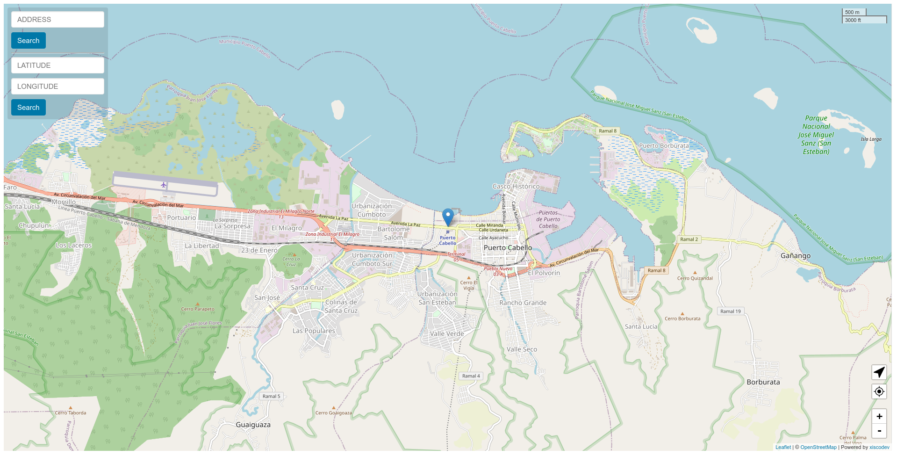

<div style="display: -ms-flexbox; display: -webkit-flex; display: flex; -webkit-flex-direction: row; -ms-flex-direction: row; flex-direction: row; -webkit-flex-wrap: wrap; -ms-flex-wrap: wrap; flex-wrap: wrap; -webkit-justify-content: space-around; -ms-flex-pack: distribute; justify-content: space-around; -webkit-align-content: center; -ms-flex-line-pack: center; align-content: center; -webkit-align-items: center; -ms-flex-align: center; align-items: center;">
  
</div>

<h1 style="text-align:center;">Geolocation Map</h1>

## What is this?
A simple application to visualize your position on a map.

## How to use it?
- Run it!

```bash
$ npm run serve:commonjs:prod
```

- Build it!
```bash
$ npm run build:commonjs:prod
```

---

## Tech stack

||||
|-|-|-|
| Javscript | [VueJS](https://vuejs.org/) | [leaflet](https://leafletjs.com/) |
| |  |  |

Powered by <a href="https://deepertech.com" target="_blank">Deepertech</a>
